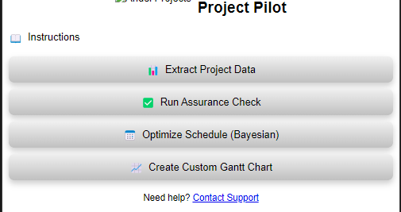

# MSTPADDIN
Alpha Testing Repo for MA Project Add In

#### [Download the Design Concept document ](https://github.com/your-username/your-repo/releases/latest/download/document.docx) 

## FUNCTIONALITY

### Button 1: Data Extraction to SQLite Database and Reporting
This button extracts all significant project data—tasks, resources, calendars, assignments, costs, custom fields—from Microsoft Project and loads it into a temporary SQLite database. This database serves as the backend for subsequent analyses and operations, facilitating efficient data management and retrieval.
Beyond data extraction, this button also allows the user to generate custom reports within Microsoft Project based on user inputs. Users can specify report parameters using Natural Language Processing (NLP) inputs, making it user-friendly and flexible.

### Button 2: Conducting Assurance Exercises Against Industry Standards
This button conducts an assurance exercise on the project data stored in the SQLite database. The user can select from various industry standards, such as the 14-point guide, ISO standards, or PMBOK. The system then checks the data against these standards, identifying potential issues and providing proposed solutions. The results are exported into an Excel document, with a separate tab for each standard. Optionally Custom Assurance against company internal standards may be offered on a bespoke basis.
### Button 3: Bayesian Analysis for Schedule Optimization
This functionality performs a Bayesian analysis on the project schedule, optimizing start dates and durations based on probabilistic models. The system runs multiple trials (e.g., 100 for a pilot) and identifies the most likely optimized schedule. The optimized dates and durations are then input back into project custom fields, with variances calculated and displayed in a custom table view.
### Button 4: Custom PiViT Gantt Chart and MarkMap Visualizations
This button allows the user to create a high-quality Gantt charts using Vega-Lite and a schedule tree using MarkMap. These visualizations are designed to be more professional and visually appealing than standard Microsoft Project charts, making them suitable for executive presentations. Users can preview the visuals before exporting them as SVG or PNG files. 

